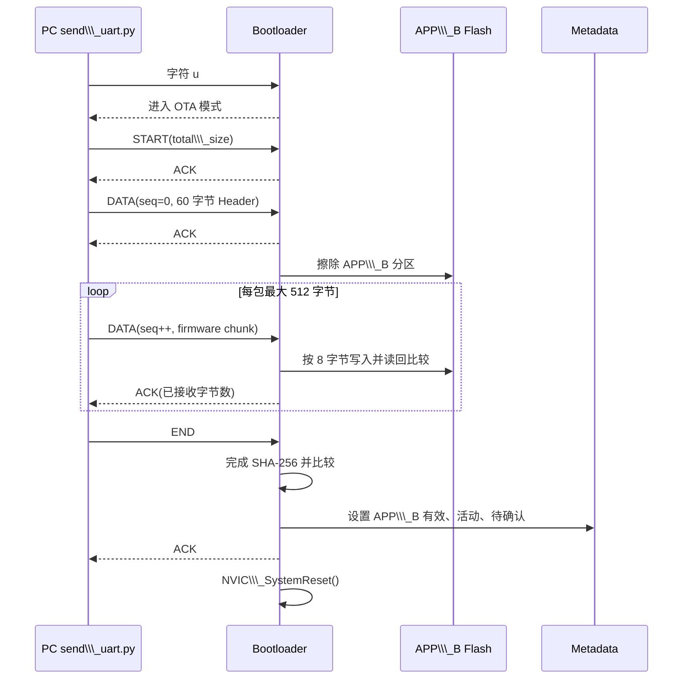
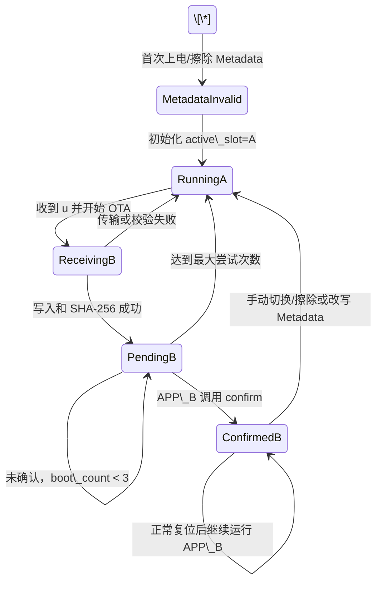

# μPQC-OTA 工程原理说明书

> **历史版本提示：** 本文档保留了早期 SHA-256-only OTA 的原理记录，其 60 字节 Header 和 `0x000E0000` APP IROM1 配置已不再适用。当前工程使用 100 字节 Header、3309 字节 ML-DSA-65 签名和每 slot 4 KB Secure Boot Manifest；请以 `固件数字签名与发布者身份认证说明-2.md` 为准。

## 1\.先烧录bootloader,再烧录APPA，测试APPA正常与否。Build APPB工程，用pc tool将APP\_B.axf文件封装header头部为firmware.ota。

如何发送APPB？

在工程根目录打开 PowerShell：

\& "D:\\Keil\\ARM\\ARMCC\\bin\\fromelf.exe" `

&#x20; --bin `

&#x20; --output "pc\_tool\\app\_b.bin" `

&#x20; "app\\MDK-ARM\\APP\_B\\APP\_B.axf"

2\. 生成 OTA 文件

cd pc\_tool

python pack.py --input app\_b.bin --output firmware.ota --version 2
如何返回APPA?


## 

## 

## 

## 

## 

## 2\. 工程组成

```text
μPQC-OTA\\\_1/
├── bootloader/                 Bootloader 工程
│   ├── Core/Inc/                 OTA 配置、协议、Metadata、Flash 接口等头文件
│   ├── Core/Src/                 Bootloader 主流程和 OTA 实现
│   └── MDK-ARM/                  Keil Bootloader Target
├── app/                        APP\\\_A/APP\\\_B 共用应用工程
│   ├── Core/Inc/app\\\_config.h     根据 APP\\\_SLOT 选择槽位地址和应用配置
│   ├── Core/Src/app\\\_confirm.c    APP 启动成功确认
│   ├── Core/Src/retarget.c       ARMCC 无 Semihosting 输出重定向
│   └── MDK-ARM/app.uvprojx       APP\\\_A 和 APP\\\_B 两个 Target
├── pc\\\_tool/                    PC 端 OTA 打包和串口发送工具
│   ├── ota\\\_format.py             OTA Header 和 UART 帧格式
│   ├── pack.py                   app\\\_b.bin -> firmware.ota
│   └── send\\\_uart.py              通过串口执行 OTA
└── OTA工程原理说明书.md       本文档
```

\---

## 3\. 系统设计目标

本工程使用 A/B 双分区设计，目标是：

1. Bootloader 始终位于固定的 Flash 起始区域。
2. APP\_A 作为稳定的基础镜像和回滚镜像。
3. 新固件只写入 APP\_B，OTA 过程不覆盖 APP\_A。
4. APP\_B 完整写入并校验通过后才能被标记为可启动。
5. APP\_B 启动后需要主动确认成功。
6. APP\_B 连续启动失败时，Bootloader 自动回滚到 APP\_A。
7. Bootloader 对可写地址和 APP 跳转地址进行边界校验。

\---

## 4\. Flash 分区规划

目标 MCU 为 STM32L4R5ZITxP，内部 Flash 容量为 2 MB，地址范围为 `0x08000000 \\\~ 0x081FFFFF`。

|分区|起始地址|结束地址|大小|用途|
|-|-|-|-:|-|
|Bootloader|`0x08000000`|`0x0801FFFF`|128 KB|启动、OTA 接收、选槽和跳转|
|APP\_A|`0x08020000`|`0x080FFFFF`|896 KB|稳定应用/回滚镜像|
|APP\_B|`0x08100000`|`0x081DFFFF`|896 KB|OTA 新固件槽位|
|Metadata|`0x081E0000`|`0x081FFFFF`|128 KB|选槽、有效性、确认和回滚状态|

```text
0x08000000  +---------------------------+
            | Bootloader     128 KB     |
0x08020000  +---------------------------+
            | APP\\\_A          896 KB     |
0x08100000  +---------------------------+
            | APP\\\_B          896 KB     |
0x081E0000  +---------------------------+
            | OTA Metadata   128 KB     |
0x08200000  +---------------------------+
```

对应配置定义位于 `bootloader/Core/Inc/ota\\\_config.h`。

## 5\. APP\_A 与 APP\_B 共用代码原理

APP\_A 和 APP\_B 不是两套独立源码，而是使用同一个 `app` 工程的两个 Keil Target。

|Target|C/C++ Define|IROM1 Start|IROM1 Size|输出目录|
|-|-|-|-|-|
|APP\_A|`APP\\\_SLOT=0`|`0x08020000`|`0x000E0000`|`MDK-ARM/APP\\\_A/`|
|APP\_B|`APP\\\_SLOT=1`|`0x08100000`|`0x000E0000`|`MDK-ARM/APP\\\_B/`|

`app\\\_config.h` 根据 `APP\\\_SLOT` 生成不同配置：

```c
#if APP\\\_SLOT == OTA\\\_SLOT\\\_A
#define APP\\\_BASE\\\_ADDR       0x08020000U
#define APP\\\_LED\\\_GPIO\\\_Port   RED\\\_LED\\\_GPIO\\\_Port
#define APP\\\_LED\\\_Pin         RED\\\_LED\\\_Pin
#elif APP\\\_SLOT == OTA\\\_SLOT\\\_B
#define APP\\\_BASE\\\_ADDR       0x08100000U
#define APP\\\_LED\\\_GPIO\\\_Port   BLUE\\\_LED\\\_GPIO\\\_Port
#define APP\\\_LED\\\_Pin         BLUE\\\_LED\\\_Pin
#endif
```

因此：

* APP\_A 链接到 `0x08020000`，运行时翻转红灯 PB14。
* APP\_B 链接到 `0x08100000`，运行时翻转蓝灯 PB7。
* 两者的业务源码和 HAL 驱动完全共用。

APP 进入 `main()` 后会执行：

```c
SCB->VTOR = APP\\\_BASE\\\_ADDR;
```

这保证中断向量从当前 APP 的链接地址开始读取。

\---

## 7\. Metadata 分区原理

Metadata 是 Bootloader 的持久化控制状态。它不保存应用代码，只保存选槽、有效性、确认和回滚信息。

### 7.1 Metadata 数据结构

```c
typedef struct {
    uint32\\\_t magic;
    uint32\\\_t active\\\_slot;
    uint32\\\_t app\\\_a\\\_valid;
    uint32\\\_t app\\\_b\\\_valid;
    uint32\\\_t pending\\\_verify;
    uint32\\\_t boot\\\_count;
    uint32\\\_t app\\\_a\\\_size;
    uint32\\\_t app\\\_b\\\_size;
    uint8\\\_t app\\\_a\\\_hash\\\[32];
    uint8\\\_t app\\\_b\\\_hash\\\[32];
    uint32\\\_t crc32;
} ota\\\_metadata\\\_t;
```

|字段|作用|
|-|-|
|`magic`|固定为 `0x4F54414D`，用于识别合法 Metadata|
|`active\\\_slot`|`0` 选择 APP\_A，`1` 选择 APP\_B|
|`app\\\_a\\\_valid`|APP\_A 是否被标记为有效|
|`app\\\_b\\\_valid`|APP\_B 是否已完整写入并校验通过|
|`pending\\\_verify`|当前新固件是否等待 APP 启动确认|
|`boot\\\_count`|等待确认阶段的启动尝试次数|
|`app\\\_a\\\_size/app\\\_b\\\_size`|应用镜像实际大小|
|`app\\\_a\\\_hash/app\\\_b\\\_hash`|镜像 SHA-256|
|`crc32`|Metadata 结构自身完整性校验|

### 7.2 Metadata CRC32

计算 Metadata CRC 时：

1. 复制整个 Metadata 结构。
2. 将副本的 `crc32` 字段设为 0。
3. 对整个结构计算标准 CRC32，多项式为 `0xEDB88320`。
4. 将结果写入 `crc32`。

Bootloader 加载 Metadata 时同时检查 `magic` 和 `crc32`。

### 7.3 Metadata 无效时的默认状态

如果 Metadata 为空、Magic 错误或 CRC 错误，Bootloader 初始化：

```text
active\\\_slot    = APP\\\_A
app\\\_a\\\_valid    = 1
app\\\_b\\\_valid    = 0
pending\\\_verify = 0
boot\\\_count     = 0
```

因此，擦除 Metadata 后系统会默认切回 APP\_A。

### 7.4 APP 选择规则

```c
if ((meta->active\\\_slot == OTA\\\_SLOT\\\_B) \\\&\\\&
    (meta->app\\\_b\\\_valid == OTA\\\_VALID)) {
    return APP\\\_B\\\_START\\\_ADDR;
}
return APP\\\_A\\\_START\\\_ADDR;
```

只有当 `active\\\_slot=APP\\\_B` 且 `app\\\_b\\\_valid=1` 时才选择 APP\_B；其他情况都选择 APP\_A。

\---

## 8\. `.ota` 文件构成

`.ota` 文件是 PC 端用于传输的升级包，它不是 Keil HEX 文件。

```text
firmware.ota = 60 字节 OTA Header + APP\\\_B 原始 BIN
```

```text
+------------------------------+ 0x0000
| OTA Header（60 字节）        |
+------------------------------+ 0x003C
| APP\\\_B 原始二进制 Payload   |
| ...                          |
+------------------------------+
```

### 8.1 OTA Header

OTA Header 使用 1 字节对齐，所有多字节整数均使用小端序。

```c
#pragma pack(push, 1)
typedef struct {
    uint32\\\_t magic;
    uint32\\\_t header\\\_version;
    uint32\\\_t firmware\\\_version;
    uint32\\\_t firmware\\\_size;
    uint32\\\_t payload\\\_size;
    uint8\\\_t firmware\\\_hash\\\[32];
    uint32\\\_t flags;
    uint32\\\_t header\\\_crc32;
} ota\\\_header\\\_t;
#pragma pack(pop)
```

|偏移|大小|字段|说明|
|-:|-:|-|-|
|`0x00`|4|`magic`|固定 `0x31544F55`|
|`0x04`|4|`header\\\_version`|当前为 `1`|
|`0x08`|4|`firmware\\\_version`|打包时传入的固件版本|
|`0x0C`|4|`firmware\\\_size`|APP\_B BIN 字节数|
|`0x10`|4|`payload\\\_size`|当前要求等于 `firmware\\\_size`|
|`0x14`|32|`firmware\\\_hash`|Payload 的 SHA-256|
|`0x34`|4|`flags`|当前为 0，为未来扩展保留|
|`0x38`|4|`header\\\_crc32`|Header CRC32|
|`0x3C`|N|Payload|APP\_B 原始 BIN|

### 8.2 Header CRC32

```text
header\\\_crc32 = CRC32(Header，但 header\\\_crc32 字段暂时填 0)
```

### 8.3 固件 Hash

```text
firmware\\\_hash = SHA256(APP\\\_B 原始 BIN)
```

Header CRC32 保护 Header 字段，SHA-256 用于检查 Payload 在打包、传输和写入过程中是否发生意外改变。

\---

## 9\. UART OTA 帧协议

`.ota` 文件会被 PC 工具切分为 UART 帧发送。

### 9.1 帧格式

```text
+------+-----+------+--------+---------+-------+
| SOF  | CMD | SEQ  | LENGTH | PAYLOAD | CRC32 |
| 1 B  | 1 B | 2 B  | 2 B    | N B     | 4 B   |
+------+-----+------+--------+---------+-------+
```

|字段|说明|
|-|-|
|`SOF`|固定为 `0xA5`|
|`CMD`|命令类型|
|`SEQ`|16 位包序号|
|`LENGTH`|Payload 字节数，最大 512|
|`PAYLOAD`|帧负载|
|`CRC32`|对 `CMD + SEQ + LENGTH + PAYLOAD` 计算 CRC32|

### 9.2 命令类型

|命令|值|作用|
|-|-:|-|
|`OTA\\\_CMD\\\_START`|`0x01`|告知 Bootloader 整个 `.ota` 文件大小|
|`OTA\\\_CMD\\\_DATA`|`0x02`|发送 Header 或固件数据|
|`OTA\\\_CMD\\\_END`|`0x03`|通知数据发送完成|
|`OTA\\\_CMD\\\_ACK`|`0x79`|Bootloader 成功应答|
|`OTA\\\_CMD\\\_ERROR`|`0x1F`|Bootloader 错误应答|

### 9.3 传输时序



### 9.4 ACK/ERROR 帧

Bootloader 状态帧的 Payload 固定为 4 字节：

```text
ACK：   Payload = 进度或 0
ERROR： Payload = 错误码
```

PC 工具会根据 SOF `0xA5` 从串口文本日志中找到真正的二进制应答帧。

\---

## 10\. OTA 接收和写入流程

### 10.1 START 阶段

PC 发送 `.ota` 文件总大小。Bootloader 检查：

```text
total\\\_size >= sizeof(ota\\\_header\\\_t)
total\\\_size <= sizeof(ota\\\_header\\\_t) + APP\\\_B\\\_SIZE
```

### 10.2 Header 阶段

第一个 DATA 帧的 Payload 必须恰好是 60 字节 Header。Bootloader 检查：

* OTA File Magic；
* Header 版本；
* `firmware\\\_size > 0`；
* `payload\\\_size == firmware\\\_size`；
* `firmware\\\_size <= APP\\\_B\\\_SIZE`；
* Header CRC32。

只有 Header 校验成功后才擦除 APP\_B。

### 10.3 APP\_B 擦除

```c
flash\\\_if\\\_erase\\\_app\\\_b();
```

擦除范围是：

```text
0x08100000 \\\~ 0x081DFFFF
```

擦除操作使用 HAL Page Erase，根据地址自动选择 Flash Bank 和 Page。

### 10.4 DATA 阶段

PC 将 Payload 按最大 512 字节分包。Bootloader 对每包进行：

1. SOF 校验。
2. 帧命令和序号校验。
3. Payload 长度校验。
4. UART 帧 CRC32 校验。
5. 整体 Payload 边界检查。
6. 写入 APP\_B 对应地址。
7. 读回 Flash 并逐字节比较。
8. 增量更新 SHA-256。
9. 返回 ACK 和已接收字节数。

STM32L4 Flash 使用 64 位 Double Word 编程，因此 `flash\\\_if\\\_write()` 以 8 字节为单位写入。最后一包不足 8 字节时使用 `0xFF` 补齐。

### 10.5 END 阶段

收到 END 帧后，Bootloader：

1. 完成 SHA-256 计算。
2. 与 OTA Header 中的 `firmware\\\_hash` 比较。
3. Hash 不一致时拒绝激活 APP\_B。
4. Hash 一致时更新 Metadata。

OTA 成功后 Metadata 变为：

```text
active\\\_slot    = APP\\\_B
app\\\_b\\\_valid    = 1
pending\\\_verify = 1
boot\\\_count     = 0
app\\\_b\\\_size     = firmware\\\_size
app\\\_b\\\_hash     = firmware\\\_hash
```

最后 Bootloader 延时 200 ms，返回 ACK，并执行系统复位。

\---

## 11\. Flash 写入安全边界

Bootloader 中的 Flash 接口只允许写入：

```text
APP\\\_B：    0x08100000 \\\~ 0x081DFFFF
Metadata： 0x081E0000 \\\~ 0x081FFFFF
```

以下区域不允许通过 OTA 写入：

```text
Bootloader：0x08000000 \\\~ 0x0801FFFF
APP\\\_A：     0x08020000 \\\~ 0x080FFFFF
```

`flash\\\_if\\\_is\\\_writable\\\_range()` 同时检查：

* 长度是否为 0；
* `address + length` 是否整数溢出；
* 整个区间是否落在 APP\_B 或 Metadata 内。

该设计可避免协议长度错误或恶意地址导致 Bootloader/APP\_A 被覆盖。

\---

## 12\. APP\_B 启动确认机制

OTA 成功后 APP\_B 第一次启动时：

```text
active\\\_slot    = APP\\\_B
app\\\_b\\\_valid    = 1
pending\\\_verify = 1
```

APP\_B 进入 `main()`、完成 HAL、时钟和 GPIO 初始化后，调用：

```c
app\\\_confirm\\\_boot\\\_ok();
```

确认函数会：

1. 从 `0x081E0000` 读取 Metadata。
2. 检查 Metadata Magic 和 CRC32。
3. 检查 `pending\\\_verify != 0`。
4. 检查 `meta.active\\\_slot == APP\\\_SLOT`。
5. 清除 `pending\\\_verify`。
6. 清零 `boot\\\_count`。
7. 重新计算 CRC32 并写回 Metadata。

关键检查：

```c
if (meta.active\\\_slot != APP\\\_SLOT) {
    return;
}
```

这防止 APP\_B 无效而 Bootloader 临时回退到 APP\_A 时，APP\_A 误确认 APP\_B。

\---

## 13\. APP\_B 启动失败回滚

Bootloader 在每次选择 APP 前执行回滚计数检查。

### 13.1 计数条件

只有满足以下条件时增加计数：

```text
active\\\_slot == APP\\\_B
pending\\\_verify != 0
```

### 13.2 最大尝试次数

```c
#define OTA\\\_MAX\\\_BOOT\\\_COUNT 3U
```

尝试过程：

```text
第 1 次启动 APP\\\_B：boot\\\_count = 1
第 2 次启动 APP\\\_B：boot\\\_count = 2
第 3 次启动 APP\\\_B：boot\\\_count = 3
下一次复位：        触发回滚
```

### 13.3 回滚状态

```text
active\\\_slot    = APP\\\_A
app\\\_b\\\_valid    = 0
pending\\\_verify = 0
boot\\\_count     = 0
```

然后 Bootloader 跳转 APP\_A。

### 13.4 当前确认时机的限制

当前 APP 在启动初期就调用 `app\\\_confirm\\\_boot\\\_ok()`。这可以检测：

* APP\_B 向量表无效；
* Reset Handler 无法执行；
* APP\_B 无法进入 `main()`；
* 时钟或 GPIO 初始化期间发生致命错误。

但是，如果 APP\_B 确认后才发生业务层故障，当前 Bootloader 不会自动回滚。生产系统建议将确认延后到：

* 稳定运行一定时间后；
* 关键外设自检通过后；
* 任务调度和通信栈启动成功后；
* 看门狗喂狗链路证明正常后。

\---

## 14\. Bootloader 到 APP 的安全跳转

### 14.1 Cortex-M 应用向量表

APP 起始地址的前两个 32 位数值是：

```text
app\\\_addr + 0：初始 MSP
app\\\_addr + 4：Reset Handler 地址
```

例如 APP\_B：

```text
0x08100000：初始主堆栈指针
0x08100004：APP\\\_B Reset\\\_Handler | Thumb Bit
```

### 14.2 APP 合法性检查

`boot\\\_is\\\_valid\\\_app()` 检查：

1. APP 起始地址必须恰好是 APP\_A 或 APP\_B。
2. MSP 必须落在 `0x20000000 \\\~ 0x2009FFFF`。
3. MSP 必须按 8 字节对齐。
4. Reset Handler 最低位必须为 1，表示 Thumb 模式。
5. Reset Handler 除去 Thumb 位后，必须落在当前选中的 APP 分区内。

不仅检查 Reset Handler 是否位于整个 Flash，还要求它位于所选槽位内，防止 APP\_A 向量表误指向 APP\_B、Bootloader 或 Metadata。

### 14.3 跳转前环境清理

Bootloader 跳转前执行：

```text
1. 关闭全局中断
2. 停止 SysTick
3. HAL\\\_DeInit()
4. HAL\\\_RCC\\\_DeInit()
5. 禁用所有 NVIC IRQ
6. 清除所有 NVIC Pending IRQ
7. 清除 PendSV 和 PendST
8. SCB->VTOR = app\\\_addr
9. CONTROL = 0
10. MSP = 向量表第 0 项
11. DSB/ISB 同步
12. 恢复中断并跳转 Reset Handler
```

清理操作可防止 Bootloader 的 SysTick、外设中断、Pending IRQ 和时钟状态污染 APP。

\---

## 15\. PC 端工具工作流程

### 15.1 生成 APP\_B BIN

APP\_B AXF 是带有符号和地址信息的 ELF 文件，OTA 需要提取纯二进制：

```powershell
\\\& "D:\\\\Keil\\\\ARM\\\\ARMCC\\\\bin\\\\fromelf.exe" `
  --bin `
  --output="pc\\\_tool\\\\app\\\_b.bin" `
  "app\\\\MDK-ARM\\\\APP\\\_B\\\\APP\\\_B.axf"
```

### 15.2 生成 `.ota`

```powershell
cd pc\\\_tool
python pack.py --input app\\\_b.bin --output firmware.ota --version 2
```

`pack.py` 执行：

1. 读取 `app\\\_b.bin`。
2. 计算 SHA-256。
3. 填写 60 字节 Header。
4. 计算 Header CRC32。
5. 输出 `Header + app\\\_b.bin`。
6. 重新解析生成结果，确认 Header、CRC 和 Hash 正确。

### 15.3 安装串口依赖

```powershell
python -m pip install pyserial
```

### 15.4 执行 UART OTA

```powershell
python send\\\_uart.py --port COM3 --baud 115200 --file firmware.ota
```

`send\\\_uart.py` 的工作：

1. 打开串口。
2. 等待 Bootloader OTA 提示。
3. 发送字符 `u`。
4. 发送 START 帧。
5. 发送 Header DATA 帧。
6. 将 APP\_B 分割为最大 512 字节的 DATA 帧。
7. 每发送一帧都等待 ACK。
8. 显示传输进度。
9. 发送 END 帧并等待最终 ACK。

Bootloader 日志和二进制 ACK 共用同一个串口，PC 工具会跳过文本字节，从 `0xA5` 开始解析 ACK/ERROR 帧。

\---

## 16\. 完整系统状态迁移



\---

## 17\. 生产烧录与正常升级流程

### 17.1 首次生产烧录

1. 选择 Sector Erase，不要在每个镜像之间执行 Full Chip Erase。
2. 烧录 Bootloader HEX 到 `0x08000000`。
3. 烧录 APP\_A HEX 到 `0x08020000`。
4. APP\_B 可以留空，等待首次 OTA。
5. Metadata 留空，Bootloader 首次启动时自动初始化 APP\_A。

### 17.2 正常升级

```text
编译 APP\\\_B
   -> 生成 app\\\_b.bin
   -> 生成 firmware.ota
   -> 复位设备
   -> PC 工具进入 OTA
   -> 擦除/写入 APP\\\_B
   -> SHA-256 校验
   -> Metadata 选择 APP\\\_B
   -> 复位
   -> APP\\\_B 启动确认
```

### 17.3 切换回 APP\_A

可选方式：

1. 擦除 Metadata 首页，Bootloader 会重建默认 APP\_A 状态。
2. 写入带正确 CRC 的 Metadata，将 `active\\\_slot` 设为 APP\_A。
3. 让待确认 APP\_B 连续启动失败，由 Bootloader 自动回滚。

仅重新烧录 APP\_A 不会自动切换，因为选槽状态保存在 Metadata。

\---

## 18\. 异常处理与错误场景

|场景|系统行为|
|-|-|
|Metadata 为空或 CRC 错误|初始化为 APP\_A|
|APP\_B Header 无效|拒绝 OTA，保持原选槽|
|APP\_B 传输中断|APP\_B 可能不完整，但不会被标记为有效|
|UART 帧 CRC 错误|拒绝当前 OTA|
|帧序号错误|拒绝当前 OTA|
|固件 SHA-256 错误|不激活 APP\_B|
|Flash 擦除/写入/读回失败|返回 ERROR，不激活 APP\_B|
|APP\_B MSP 无效|拒绝跳转，尝试 APP\_A|
|APP\_B Reset Handler 越界|拒绝跳转，尝试 APP\_A|
|APP\_B 未确认|递增 `boot\\\_count`，达到阈值后回滚|
|APP\_A 和 APP\_B 都无效|Bootloader 留在 OTA 等待模式|

\---

## 19\. 调试和验证方法

### 19.1 检查向量表

可在 STM32CubeProgrammer 或 Keil Memory 窗口读取：

|地址|内容|
|-|-|
|`0x08000000`|Bootloader 初始 MSP|
|`0x08000004`|Bootloader Reset Handler|
|`0x08020000`|APP\_A 初始 MSP|
|`0x08020004`|APP\_A Reset Handler，应位于 `0x0802xxxx`|
|`0x08100000`|APP\_B 初始 MSP|
|`0x08100004`|APP\_B Reset Handler，应位于 `0x0810xxxx`|
|`0x081E0000`|Metadata Magic|

### 19.2 通过 PC 判断当前 APP

读取 Cortex-M PC：

```text
PC 在 0x08020000 \\\~ 0x080FFFFF：正在运行 APP\\\_A
PC 在 0x08100000 \\\~ 0x081DFFFF：正在运行 APP\\\_B
PC 在 0x08000000 \\\~ 0x0801FFFF：正在运行 Bootloader
```

### 19.3 通过 LED 判断

```text
红灯 PB14 闪烁：APP\\\_A
蓝灯 PB7 闪烁： APP\\\_B
```

### 19.4 串口日志

正常 Bootloader 启动可看到：

```text
\\\[BOOT] Bootloader start
\\\[BOOT] Metadata loaded
\\\[OTA] Send 'u' within 1 second to enter OTA mode
\\\[BOOT] Try boot App A/B
\\\[BOOT] Jump to app: 0x........
```

\---

## 20\. 当前安全能力

当前安全配置：

```c
#define DEMO\\\_HASH\\\_ONLY        1
#define ENABLE\\\_AES\\\_GCM        0
#define ENABLE\\\_ML\\\_DSA\\\_VERIFY  0
```

### 20.1 已实现能力

* OTA Header Magic 和版本检查。
* OTA Header CRC32。
* UART 帧 CRC32。
* APP\_B SHA-256 完整性校验。
* Flash 写后读回比较。
* Flash 可写地址白名单。
* APP 向量表和跳转地址边界检查。
* APP\_B 启动确认。
* APP\_B 启动失败自动回滚。

### 20.2 尚未实现的生产级能力

* 固件数字签名和发布者身份认证。
* ML-DSA/Dilithium 后量子签名验证。
* AES-GCM 固件加密和认证加密。
* 密钥安全存储。
* 固件版本单调性和防降级。
* Bootloader Secure Boot 和自身完整性验证。
* 掉电继传、断点续传和交易式 Metadata。
* 多副本 Metadata 和冗余保护。

### 20.3 SHA-256 的安全边界

SHA-256 可以发现传输损坏，但不能证明固件来自可信发布者。攻击者如果能替换固件，也能重新计算 SHA-256 和 Header CRC32。

因此当前 `DEMO\\\_HASH\\\_ONLY` 适合验证 OTA 工作流程，不应直接视为可防恶意固件的生产安全方案。

\---

## 21\. 建议的生产化改进

1. 在 OTA Header 中加入签名长度、算法 ID、硬件型号和最低允许版本。
2. 使用 ML-DSA 或其他可信数字签名验证发布者。
3. 只将公钥或公钥 Hash 固化在受保护 Bootloader 区域。
4. 启用 Flash Write Protection/PCROP 保护 Bootloader 和公钥。
5. 实现防降级版本计数器。
6. Metadata 使用双副本、序列号和交易提交标志，避免擦写时掉电导致状态丢失。
7. 使用固件大小精确擦除 APP\_B，或明确完整擦除和磨损策略。
8. 将 APP 确认延后到健康检查通过后。
9. 实现看门狗与启动失败计数的完整配合。
10. 增加 UART 包重传、超时恢复和断点续传。
11. 增加镜像目标硬件 ID，防止不兼容固件被写入。
12. 保留完整的升级原因、失败原因和回滚日志。

\---

## 22\. 主要源码导航

|功能|文件|
|-|-|
|Flash 分区与 OTA 宏|`bootloader/Core/Inc/ota\\\_config.h`|
|Bootloader 主流程|`bootloader/Core/Src/main.c`|
|APP 校验与跳转|`bootloader/Core/Src/boot\\\_jump.c`|
|Metadata 加载、保存、选槽和回滚|`bootloader/Core/Src/ota\\\_metadata.c`|
|UART OTA 接收|`bootloader/Core/Src/ota\\\_transport\\\_uart.c`|
|OTA Header 校验|`bootloader/Core/Src/ota\\\_protocol.c`|
|Flash 擦除和写入|`bootloader/Core/Src/flash\\\_if.c`|
|CRC32|`bootloader/Core/Src/crc32.c`|
|SHA-256|`bootloader/Core/Src/ota\\\_crypto.c`|
|APP\_A/APP\_B 差异配置|`app/Core/Inc/app\\\_config.h`|
|APP 启动确认|`app/Core/Src/app\\\_confirm.c`|
|APP 主程序|`app/Core/Src/main.c`|
|OTA 文件和帧格式|`pc\\\_tool/ota\\\_format.py`|
|OTA 打包|`pc\\\_tool/pack.py`|
|UART OTA 发送|`pc\\\_tool/send\\\_uart.py`|

\---

## 23\. 总结

本工程的核心是：

```text
Bootloader 始终保留
        +
APP\\\_A 作为稳定回滚镜像
        +
APP\\\_B 作为 OTA 新固件镜像
        +
Metadata 记录选槽和确认状态
        +
CRC32/SHA-256 检查传输和数据完整性
        +
APP\\\_B 启动确认失败时回滚 APP\\\_A
```

在当前阶段，它是一套可用于学习、调试和验证双分区 OTA 流程的完整原型。若用于真实产品，还需要引入数字签名、防降级、密钥保护、冗余 Metadata 和更严格的应用健康确认机制。
